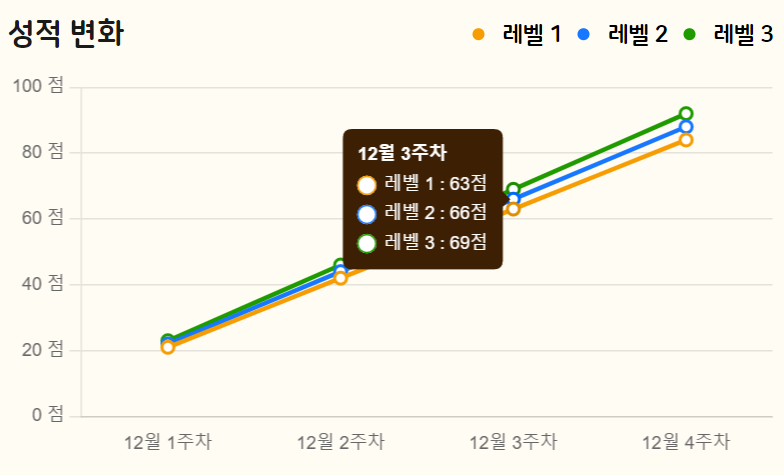

## Chart.js
[npmtrends](https://npmtrends.com/chart.js-vs-plotly.js-vs-react-chartjs-2-vs-recharts)를 기준으로 볼 때, 그래프와 관련된 라이브러리에서 단연 으뜸은 `Chart.js`라이브러리일 것이다. 
<p align="center"></p>

`Chart.js`는 다양한 도표들을 그릴 수 있는데 관련된 내용은 공식 문서를 참고하면 쉽게 구현할 수 있다. 

<details>
  <summary>Options Settings</summary>

  ---
  ```javascript
  // 리액트(넥스트) 타입스크립트에서 해당 라이브러리를 사용하기 위해서는 아래와 같이 기본적으로 선언해야 하는 값들이 있다. 
  import {
    Chart as ChartJS,
    CategoryScale,
    LinearScale,
    PointElement,
    LineElement,
    Title,
    Tooltip,
    Legend,
  } from 'chart.js';
  import { Line } from 'react-chartjs-2';

  ChartJS.register(
    CategoryScale,
    LinearScale,
    PointElement,
    LineElement,
    Title,
    Tooltip,
    Legend
  );

  const options = {
      responsive: boolean,
      maintainAspectRatio: boolean,
      interaction: {},
      stacked: boolean,
      plugins: {
        legend: {},
        tooltip: {},
      }, 
      scales: {
        x: {},
        y: {},
      },
      elements: {
        point: {},
        line: {
          tension: 0.2,
        },
      },
    };
  ```
  - `responsive` : 반응형으로 그래프를 동작하게 할 것인지를 설정한다. 그러나 해당설정은 window.resize 되었을 때, 그래프가 줄어들며 살아지는 효과를 주기도 하기에, false로 설정값을 변경하자.
    - `maintainAspectRatio` : 는 그래프의 종횡비를 유지할 것인지에 대한 설정값으로, true를 설정하면, 가로세로 비율이 유지된다. 반면, false로 설정하면, 가능한 공간에 따라 차트가 늘어나거나 줄어들게 된다.
    - `interaction` : 차트와 사용자 간의 상호작용에 대한 부분을 설정한다. 
</details>
